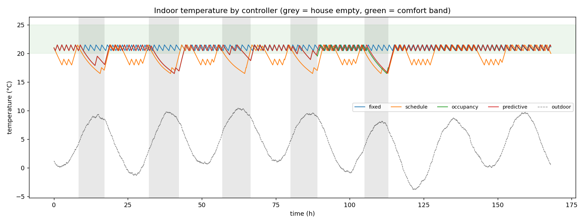
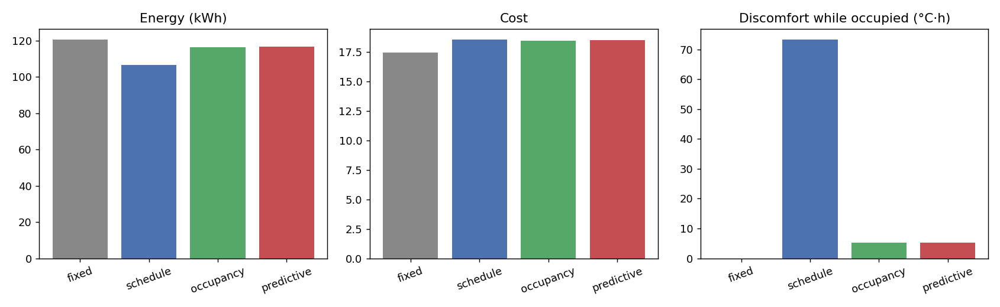

# Smart Home Occupancy & HVAC Control Simulator

A lightweight Python simulator that compares **HVAC control strategies** for a single-zone smart home.
It models the building physics, a stochastic household with a noisy occupancy sensor, a heat-pump
with short-cycle protection, and a time-of-use electricity tariff, then scores each controller on
**energy, cost, comfort and equipment wear**.

The core uses only the Python standard library (matplotlib is optional, for plots).



## Features

- **Thermal model** – 1R1C lumped-capacitance house: `C·dT/dt = UA·(T_out − T_in) + Q_hvac + Q_internal`
- **Occupancy model** – weekday work routines, weekend errands, randomised per resident (seeded, reproducible)
- **Noisy sensor** – PIR-style motion sensor with missed detections (e.g. sleeping) and false triggers
- **HVAC unit** – heating/cooling capacity, COP, hysteresis thermostat, minimum on/off times
- **Four controllers** run on *identical* weather and occupancy for a fair comparison:

| Controller   | Idea |
|--------------|------|
| `fixed`      | Constant 21/24 °C setpoints 24/7 (baseline) |
| `schedule`   | Programmable thermostat; fixed weekly schedule, blind to real occupancy |
| `occupancy`  | Comfort setpoints while motion seen in the last 45 min, otherwise setback |
| `predictive` | Occupancy-aware **plus** learns arrival times per 15-min bin and pre-heats/pre-cools |

- **Metrics** – energy (kWh), TOU cost, discomfort (°C·h outside 20–25 °C while someone is home),
  % of occupied time comfortable, number of compressor starts
- **Outputs** – console table, CSV traces, PNG plots

## Quick start

```bash
git clone https://github.com/<your-username>/smart-home-hvac-simulator.git
cd smart-home-hvac-simulator
python -m smart_hvac --scenario winter --days 7
```

Optional plots:

```bash
pip install -r requirements.txt
python -m smart_hvac --scenario summer --days 14 --plot --out results
```

### CLI options

| Flag | Default | Description |
|------|---------|-------------|
| `--scenario` | `winter` | `winter`, `summer` or `mild` |
| `--days` | `7` | Simulated days |
| `--seed` | `42` | RNG seed (same seed ⇒ same weather & occupancy) |
| `--residents` | `2` | Number of people in the home |
| `--dt` | `60` | Time step in seconds |
| `--out` | `results` | Directory for CSV / PNG output |
| `--plot` | off | Save PNG plots |
| `--no-csv` | off | Skip CSV traces |

## Example results (winter, 7 days, seed 42)

```
controller  energy kWh  saving %    cost  discomf C.h  comfort %  cycles
------------------------------------------------------------------------
fixed            120.6       0.0   17.47          0.0      100.0      99
schedule         106.5      11.7   18.56         73.3       53.5      63
occupancy        116.5       3.4   18.48          5.2       96.3      84
predictive       116.7       3.2   18.51          5.2       96.5      83
```

Over a longer 28-day winter run the predictive controller has learned the household's routine:

```
fixed            458.0       0.0   66.01          0.0      100.0     385
schedule         404.8      11.6   70.59        384.0       48.9     247
occupancy        442.7       3.3   70.28         23.7       96.7     331
predictive       448.3       2.1   65.34          1.8       99.7     343
```

**Take-aways**

- The fixed schedule saves the most energy but is the least comfortable, because it ignores when people are *actually* home.
- Reactive occupancy control keeps comfort high but people walk into a cold house and wait for recovery.
- Predictive control spends a little extra energy pre-conditioning, and in return nearly eliminates discomfort.
- Setback saves cost only modestly here because the home is occupied ~70% of the time; savings grow with longer absences.
- Pre-heating can shift load into the evening peak tariff, so lower energy does not always mean lower cost.



## Project structure

```
smart_hvac/
├── config.py       # dataclasses: thermal, HVAC, simulation, scenarios
├── weather.py      # synthetic outdoor temperature
├── occupancy.py    # household occupancy + noisy motion sensor
├── thermal.py      # RC building model
├── hvac.py         # HVAC unit + hysteresis thermostat
├── controllers.py  # fixed / schedule / occupancy / predictive
├── simulator.py    # simulation loop
├── metrics.py      # energy, cost, comfort, cycles
├── plotting.py     # optional matplotlib plots
└── cli.py          # command line entry point
tests/              # unit + end-to-end tests
docs/               # example plots
```

## Run the tests

```bash
python -m unittest discover -s tests -v
```

## Adding your own controller

```python
from smart_hvac.controllers import Controller, Observation

class MyController(Controller):
    name = "mine"
    def update(self, obs: Observation):
        # return (heat_setpoint_C, cool_setpoint_C)
        return (22.0, 25.0) if obs.motion else (18.0, 28.0)
```

Then add it to `all_controllers()` in `smart_hvac/controllers.py`.

## Model assumptions & limitations

- Single thermal zone, no solar gain, humidity or ventilation.
- Constant COP (real heat pumps degrade at low outdoor temperatures).
- Euler integration; stable for time steps up to a few minutes given the large time constant.
- Occupancy patterns are synthetic, not measured data.

Ideas for extension: multi-room zoning, COP vs. outdoor temperature, PID/MPC controllers,
real weather/occupancy datasets, a web dashboard.

## License

MIT – see [LICENSE](LICENSE).
